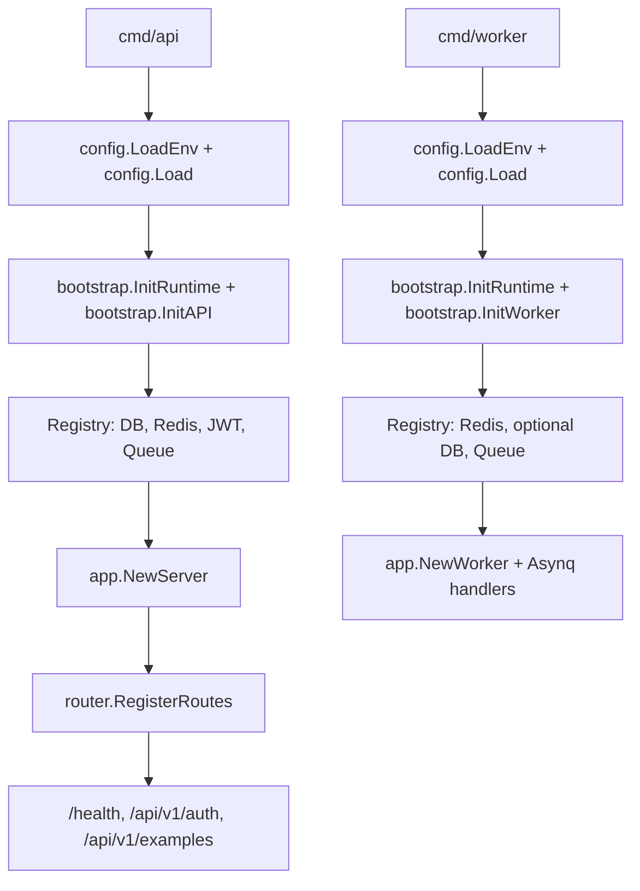

# Go Skeleton

This is a clean Go service skeleton extracted from the original project shape.
Business modules were intentionally removed; the only domain-like code left is
the `Example` flow used to demonstrate the app layers.

## Structure

- `cmd/api`: HTTP API process.
- `cmd/worker`: Asynq worker process.
- `cmd/migrate`: minimal GORM migration entrypoint for the example table.
- `config`: environment loading and typed configuration values.
- `internal/bootstrap`: process-level resource initialization and lifecycle.
- `internal`: application wiring, routes, middleware, and example layers.
- `pkg`: reusable infrastructure helpers, including generic JWT auth.

## Run with Docker Compose

Start Postgres, Redis, migrations, the API, and the worker:

```sh
make compose-up
curl http://127.0.0.1:3000/health
```

Override host ports when the defaults are already in use:

```sh
POSTGRES_PORT=55433 REDIS_PORT=56380 API_PORT=53000 make compose-up
```

Stop the stack without deleting its data volumes:

```sh
make compose-down
```

## Run Locally

```sh
cp .env.example .env
make migrate
go run ./cmd/api
```

Run the worker when Redis is configured:

```sh
go run ./cmd/worker
```

Run the example migration when Postgres is configured:

```sh
go run ./cmd/migrate
```

## Runtime Dependencies

- The API process requires `POSTGRES`.
- Redis is optional for the API process. When configured, it enables cache and queue publishing.
- The worker process requires `REDIS_ADDR`.
- Postgres is optional for the worker process.
- JWT auth example routes are enabled when `JWT_SECRET` is configured.

## Example API

Issue a sample JWT:

```sh
curl -X POST http://127.0.0.1:3000/api/v1/auth/token \
  -H 'Content-Type: application/json' \
  -d '{"subject":"demo"}'
```

Call the protected example endpoint:

```sh
curl http://127.0.0.1:3000/api/v1/auth/me \
  -H "Authorization: Bearer <access_token>"
```

Publish the sample async task when Redis is configured:

```sh
curl -X POST http://127.0.0.1:3000/api/v1/examples/tasks \
  -H 'Content-Type: application/json' \
  -d '{"name":"demo"}'
```

## Startup Flow



## Deployment Notes

- Swagger is not enabled in this skeleton. Deployment does not require `swag init`.
- If Swagger is added later, generate docs during development or CI build, not at service startup.
- `CORS_ALLOW_ORIGINS` is a comma-separated allow list. Empty means no CORS allow headers.
- Replace `JWT_SECRET` before using the auth example outside local development.
- API business errors use the JSON envelope `code`, `msg`, and `reason`; most API errors are returned with HTTP 200 by convention.
- `/health` uses real HTTP status codes and returns 503 when required dependencies are unavailable.

## Verify

Run the local CI checks (format, module state, vet, race tests, and builds):

```sh
make ci
```

Run real Postgres, Redis cache, and Redis queue integration tests in an
isolated Compose project:

```sh
make integration-up
make test-integration
make integration-down
```

The integration suite has an explicit `integration` build tag and requires
`TEST_POSTGRES_DSN`, `TEST_REDIS_ADDR`, `TEST_REDIS_CACHE_DB`, and
`TEST_REDIS_QUEUE_DB`. `make test-integration` supplies safe local defaults;
CI points the same tests at its Postgres and Redis service containers.
For concurrent worktrees, override `INTEGRATION_PROJECT`,
`INTEGRATION_POSTGRES_PORT`, and `INTEGRATION_REDIS_PORT` with unique values.

Other useful targets are listed by:

```sh
make help
```
